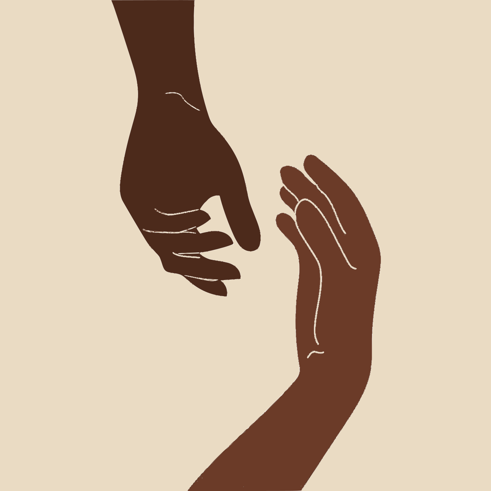
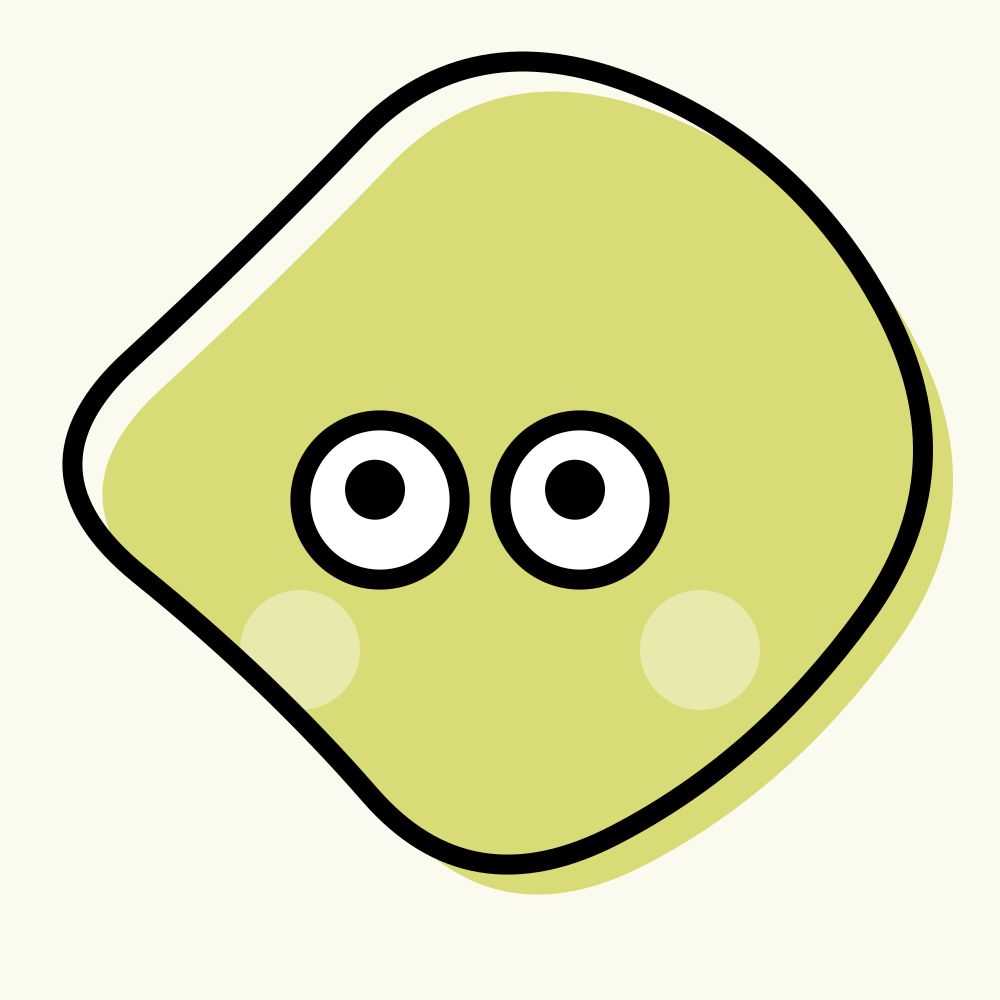
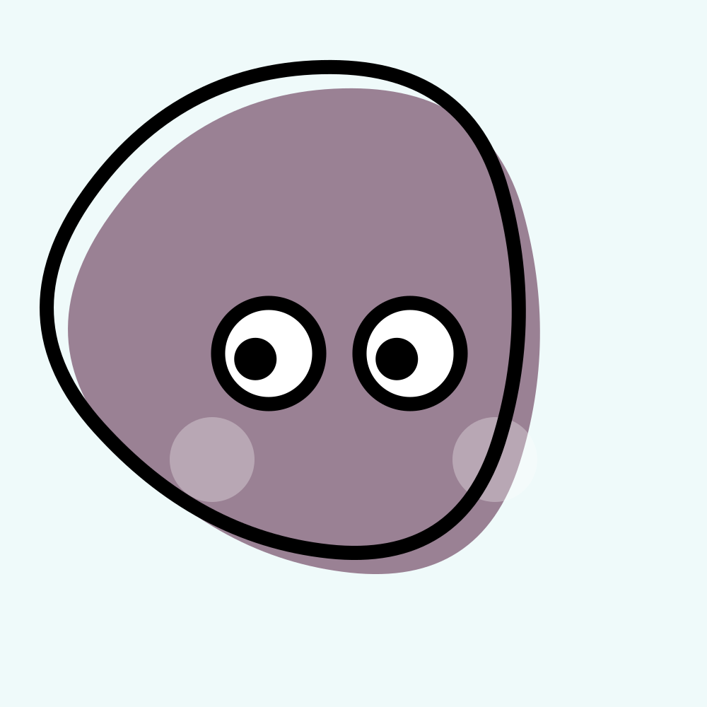

## SVG container and generator
Simple experiment to convert the image to svg and also, generate the random svg characeter.

### 1. Set Up the Environment

First, create a Python virtual environment and install the required dependencies:

```bash
python3 -m venv .venv
source .venv/bin/activate
pip install -r requirements.txt
```

> If you encounter issues installing **`pypotrace`**, it's likely due to missing system dependencies. Refer to the [pypotrace PyPI page](https://pypi.org/project/pypotrace/) for installation instructions.


### 2. Run the Flask Application
Start the Flask server with:
```bash
python run.py
```
Once running, you can generate random characters and convert images to SVG format directly through the app.

**Algorithm for Image to SVG converter**

The image-to-SVG conversion script performs the following steps:

* Apply **K-means clustering** to reduce the image to *K* dominant colors.
* Generate a **binary mask** for each color cluster.
* Use **Potrace** to convert each binary mask into vector paths.
* Combine the paths into a single **SVG file**, using cluster colors as fill values.
* Save the result as a scalable vector image.

To run this process independently, execute:

```bash
python app/main/imgae_to_svg.py
```

> Note: The image quantization method used in **Pillow** differs from that in **OpenCV**. If you're curious about the differences, check out this [notebook](./notebook/Donot_use_pillow_quantize.ipynb).
> Although `scikit-learn` could be used for quantization, OpenCV already provides the required functionality, so no additional libraries are necessary.

### Folder structure of the flask application
> For easier navigation to code.
```markdown
img_to_svg/
│
├── app/
│   ├── __init__.py
│   ├── main/
│   │   ├── __init__.py
│   │   ├── routes.py
│   │   ├── character.py
│   │   └── image_to_svg.py
│   ├── templates/
│   │   ├── base.html
│   │   ├── character.html
│   │   └── image_to_svg.html
│   └── static/
│       ├── css/
│       │   └── style.css
│       └── uploads/
│
├── run.py
├── config.py
└── requirements.txt
```

### Demo

| Image to SVG               | Character               | Character Animation          |
|---------------------------|-------------------------|------------------------------|
|  |  |  |


### References

* 📘 [Pillow Documentation](https://pillow.readthedocs.io/en/stable/)
* 📘 [OpenCV Documentation](https://docs.opencv.org/4.x/d6/d00/tutorial_py_root.html)
* 📘 [Potrace Documentation](https://pythonhosted.org/pypotrace/)
* 📘 [Flask Documentation](https://flask.palletsprojects.com/en/stable/)
* 📦 [pypotrace on PyPI](https://pypi.org/project/pypotrace/)

